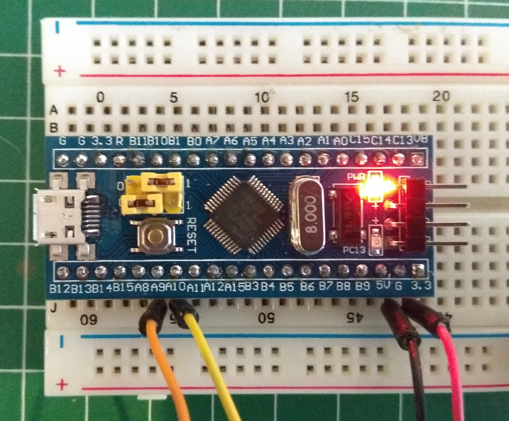

# All My Circuits

This repository is intended to serve as a base project to build firmwares for cheap chinese _Bluepill_ boards based on STM32F103C8T6 Cortex M3 processor. We use [libopencm3](https://github.com/libopencm3/libopencm3) as our main library and flash the boards with a simple USB to serial converter using [stm32loader.py](https://github.com/jsnyder/stm32loader).

# Initial setup

Initialise submodules

```
git submodule init
git submodule update

```

# Toolchain Installation

There are different options to get the toolchain up and running:

* On some Linux distributions (Debian and Ubuntu) you can install them from the repositories looking for _gcc-arm-eabi_ or _gcc-arm-none-eabi_
* You can also download it from the ARM web page using the following link and choosing the right one for your OS: https://developer.arm.com/open-source/gnu-toolchain/gnu-rm/downloads In order to install this verion unpack it and add TOLCHAIN_PATH/bin' and TOLCHAIN_PATH/sbin to your PATH system variable.

# Build

Once the toolchain is installed properly you can build by using the provided _Makefile_. The first time you must use ```make all``` to download _libopencm3_ and build it. After that you can use ```make bin``` to speed up compilation avoiding to rebuild _libopencm3_ every time.

# Flashing the firmware

The resulting binary firmware _bluepill_test.bin_ can be flashed to the actual board using a simple USB to serial converter (FTDI or similar). The wiring should be as follows:

Bluepill | FTDI
------------ | -------------
GND | GND
3.3V | 3.3V
A9 | RXD
A10 | TXD

Note that in order to flash a binary firmware it is necessary to configure the BOOT0 jumper in position 1 as shown in the following picture:



To talk to the board you can use a python script called _stm32loader.py_:

```
wget https://raw.githubusercontent.com/jsnyder/stm32loader/master/stm32loader.py
```
To use this software you have to install _pyserial_.

```
sudo pip install pyserial
```

Finally you can flash the new firmware with the command shown below. Remember to change SERIAL_PORT with the path assigned to your USB to serial converter (e.g. dev/ttyUSB0):

```
python stm32loader.py -p SERIAL_PORT -e -w -V -g 0x08000000 -v bluepill_test.bin
```

# Related Projects

* stm32loader.py: https://github.com/jsnyder/stm32loader
* libopencm3: https://github.com/libopencm3/libopencm3
* pill_blink: https://github.com/satoshinm/pill_blink
* Large set of examples with the stm32f1 microcontroller: https://github.com/g4lvanix/STM32F1-workarea
